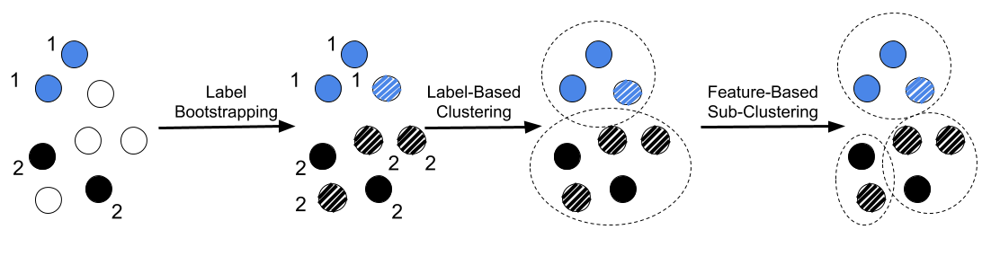

## DP-GCN
A PyTorch implementation of "Node Clustering Enabled Differentially Private Graph Convolutional Neural Networks".

### Abstract

<p align="justify">
Graph Convolutional Networks (GCNs) have been demonstrated as powerful tools for analyzing graph-structured data. However, there is an increasing concern over the sensitive information residing in the training graphs of GCNs. For instance, edges of a social network graph could reveal private real-life connections, and protecting such information is crucial to ensure user privacy.</p>
<p align="center">

</p>
<p>
In this work, we propose the first differentially private GCN (DP-GCN) based on node clustering. We show that directly adding Laplacian noise in the adjacency matrix is insufficient in preserving model utility because the sparse signals in an adjacency matrix are highly vulnerable to noise injection. Motivated by this, we design a noise-resilient GCN structure via node clustering. Our DP-GCN relies on aggregated node-tocluster connections that are less sensitive to the fine-grained noise. We prove that DP-GCN guarantees edge differential privacy and empirically show that it preserves much higher data accuracy compared to different baselines on several large graph datasets. In addition, we gain insights about factors that affect edge privacy on graph data by analyzing the tradeoff between data utility and node degree distribution as well as the number of node clusters.</p>

<!-- This repository provides a PyTorch implementation of DP-GCN as described in the paper: -->

<!-- > Node Clustering Enabled Differentially Private Graph Convolutional Neural Networks

> Wei-Lin Chiang, Xuanqing Liu, Si Si, Yang Li, Samy Bengio, Cho-Jui Hsieh.
> KDD, 2019.
> [[Paper]](https://arxiv.org/abs/1905.07953) -->


### Requirements
The codebase is implemented in Python 3.6.5. Package versions used for development are listed below.
```
networkx           1.11
numpy              1.15.4
pandas             0.23.4
scikit-learn       0.20.0
scipy              1.1.0
tensorboardX       2.0
torch              1.2.0
tqdm               4.28.1
```

### Options
<p align="justify">
The training and testing of a DP-GCN model is handled by the `main.py` script which provides the following command line arguments.</p>

#### Input and output options
```
  NAME                  TYPE    DESCRIPTION                 DEFAULT or AVAILABLE OPTIONS

  --dataset         STR    Dataset name for current run     {`cora`, `citeseer`, `facebook`}
  --train-ratio     FLOAT  Ratio for labeled nodes          Default is 0.5
  --test            BOOL   Training or testing mode         Default is False
  --model-path      STR    Path of checkpoint for testing   Default is ``
```
The checkpoint of each run is automatically saved in the folder named after elements in model options as well as the time for this run, e.g., `model_facebook/mode-clusteradj_ratio-0.04_eps-0.1_label_02-06-00:27:04.836/model.pt`

#### Training Mode Options
```
  --num-epochs          INT     Number of training epochs.           Default is 500
  --display             BOOL    Whether to show progress bar.        Default is False

  --mode                STR     Training mode.                       {`vanilla-clean`, `vanilla`, 
                                                                     `clusteradj-clean`, `clusteradj`}
  --cluster-method      STR     Clustering method.                   {`hierarchical`, `random`, `kmeans`}
  --init-method         STR     Initialization method for unlabeled  {`knn`, `naive`, `gt`}
                                nodes.
  --knn                 INT     The parameter `k` in KNN.            Default is -1 for automatic selection; 
                                                                     other positive number for predefined K.
  --break-down          BOOL    Whether to do sub-clustering in      Default is False
                                hierarchical clustering.
  --n-clusters          INT     Number of clusters in K-Means        Default is 10
                                /random clustering.
  --same-size           BOOL    Whether to do same-size clustering   Default is 
                                in K-Means Clustering.
```
Mode `vanilla-clean` and `vanilla` correspond to the vanilla-GCN model, while mode `clusteradj-clean` and `clusteradj` correspond to our DP-GCN model. The suffix `-clean` denotes training on a clean graph, otherwise, the training is performed on a noisy graph.

#### Random Seed
```
  --noise-seed          INT     Seed for generating Laplacian noise.  Default is 42
  --cluster-seed        INT     Seed used in random clustering.       Default is 42
```

#### Privacy Parameters and Model Hyperparameters

```
  --epsilon             FLOAT   Parameter `epsilon` (Privacy budget). Default is 0.1
  --delta               FLOAT   Parameter `delta`                     Default is 1e-5
  --hidden              INT     Number of hidden units.               Default is 16.
  --dropout             FLOAT   Dropout rate rate.                    Default is 0.5.
  --lr                  FLOAT   Adam learning rate.                   Default is 0.01
  --weight_decay        FLOAT   Adam weight decay                     Default is 5e-4
```


#### Ablation Study Options

```
  --break-ratio         FLOAT   Ablation study: total number         Default is 1 
                                of clusters.
  --feature-size        INT     Ablation study: size of features.    Default is -1 for original size; 
                                                                     other positive number for predefined size.
```


### Examples

The full list of commands can be found in the script folder.

#### Training on Clean Graphs

Following are a list of commands that train the desired models on clean graphs.

* Training a vanilla GCN on a clean graph on Facebook dataset, with 0.4% labeled nodes.

```
python main.py --dataset facebook --mode vanilla-clean --train-ratio 0.004
```

* Training a DP-GCN on a clean graph using hierarchical clustering, with 0.4% labeled nodes.

```
python main.py --dataset facebook --mode clusteradj-clean --break-down --train-ratio 0.004
```

* Training a DP-GCN on a clean graph using K-Means clustering with cluster number equal to 4 (the number of classes).
```
python main.py --dataset facebook --mode clusteradj-clean --cluster-method kmeans --n-clusters 4 --train-ratio 0.004
```

* Training a DP-GCN on a clean graph using random clustering with cluster number equal to 4 (the number of classes).

```
python main.py --dataset facebook --mode clusteradj-clean --cluster-method random --n-clusters 4 --cluster-seed 42 --train-ratio 0.004
```

#### Training on Noisy Graphs

Following are a list of commands that train the desired models on noisy graphs satisfying certain privacy requirements.
* Training a vanilla GCN on a noisy graph on Facebook dataset, with 0.4% labeled nodes. The privacy budget is 0.1 and the random seed for generating the Laplacian noise is 42.
```
python main.py --eps 0.1 --noise-seed 42 --dataset facebook --mode vanilla --train-ratio 0.004
```

* Training a DP-GCN on a noisy graph using hierarchical clustering, with 0.4% labeled nodes. The privacy budget is 0.1 and the random seed for generating the Laplacian noise is 91.
```
python main.py --eps 0.1 --noise-seed 91 --dataset facebook --mode clusteradj --break-down --train-ratio 0.004
```

* Training a DP-GCN on a noisy graph using K-Means clustering with cluster number equal to 4 (the number of classes). The privacy budget is 1 and the random seed for generating the Laplacian noise is 52.

```
python main.py --eps 1 --noise-seed 52 --dataset facebook --mode clusteradj --cluster-method kmeans --n-clusters 4 --train-ratio 0.004
```


* Training a DP-GCN on a noisy graph using random clustering with cluster number equal to 4 (the number of classes). The privacy budget is 10 and the random seed for generating the Laplacian noise is 42.

```
python main.py --eps 10 --noise-seed 42 --dataset facebook --mode clusteradj --cluster-method random --n-clusters 4 --cluster-seed 42 --train-ratio 0.004
```
